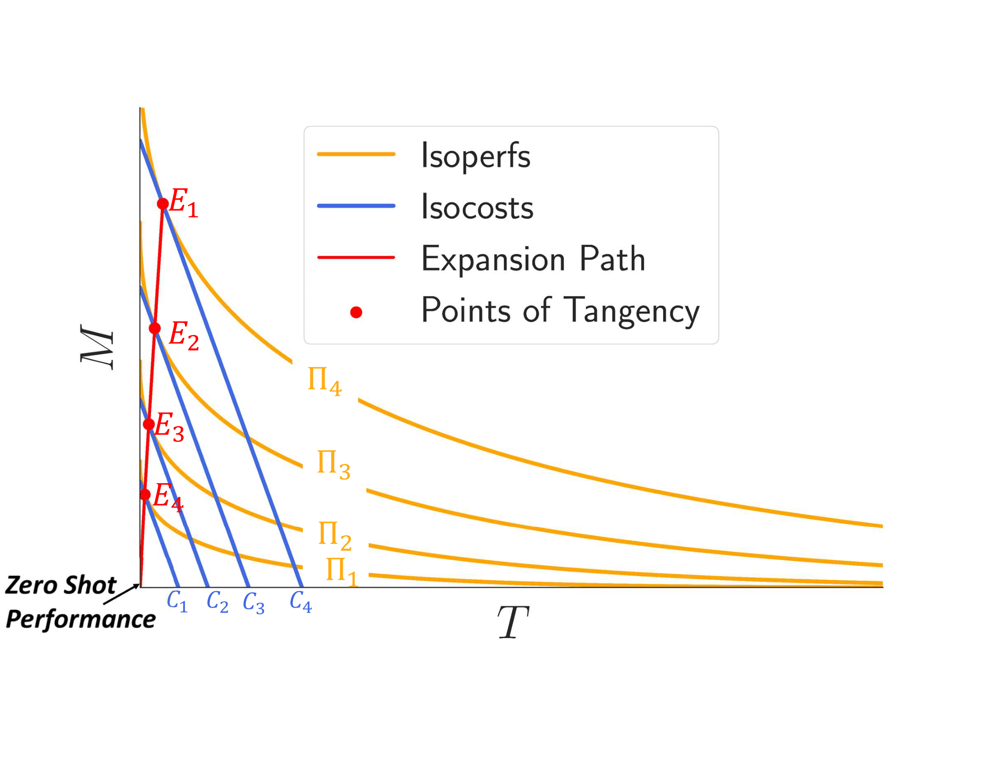

# PerformanceFunctionAnalysis

<h3 align="center"> On the Economics of Multilingual Few-shot Learning: Modeling the
Cost-Performance Trade-offs of Machine Translated and Manual Data </h3>

Borrowing ideas from *Production functions* in micro-economics, in this paper we introduce a framework 
to systematically evaluate the performance and cost trade-offs between machine-translated and manually-created labelled data for task-specific fine-tuning of massively multilingual language models. We illustrate the effectiveness of our framework through a case-study on the TyDIQA-GoldP dataset. One of the interesting conclusions of the study is that if the cost of machine translation is greater than zero, the optimal performance at least cost is always achieved with at least some or only manually-created data. To our knowledge, this is the first attempt towards extending the concept of production functions to study data collection strategies for training multilingual models, and can serve as a valuable tool for other similar cost vs data trade-offs in NLP.

<h2 align="center">
  
</h2>

#### Dependencies
- Compatible with Python3.7
- The necessary packages can be install through requirements.txt.

#### Setup
Install VirtualEnv using the following (optional):

```shell
$ [sudo] pip install virtualenv
```
We recommend creating a virtual environment(optional):

```shell
$ virtualenv -p python3 venv
$ source venv/bin/activate
```
Finally, install the required packages by running:

```shell
pip install -r requirements.txt
```

#### Resources

We provide the Performance Data by training with 3080 different data configurations for TyDiQA-GoldP dataset as described in the paper. These can be found in `performance_data/tydiqa_mbert_results.csv`

These numbers were obtained by fine-tuning the Multilingual BERT or mBERT on TyDiQA-GoldP datasets by modifying the scripts provided in the [XTREME Benchmark](https://github.com/google-research/xtreme)
